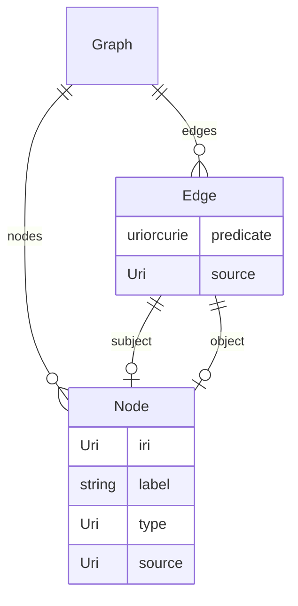

```mermaid
erDiagram
Graph {

}
Edge {
    uriorcurie predicate  
    Uri source  
}
Node {
    Uri iri  
    string label  
    Uri type  
    Uri source  
}

Graph ||--}o Node : "nodes"
Graph ||--}o Edge : "edges"
Edge ||--|o Node : "subject"
Edge ||--|o Node : "object"

```

